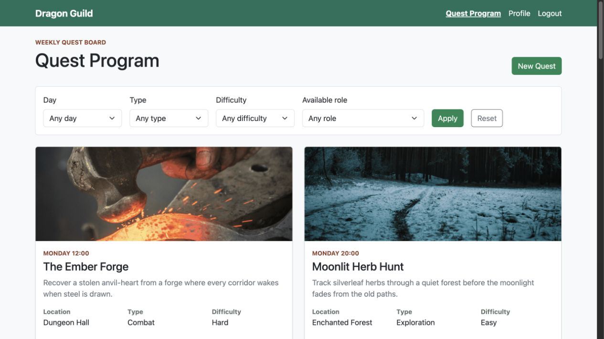

<div align="center">

# Dragon Guild

### Plan the week. Build the party. Start the quest.

A full-stack scheduling application for managing fantasy guild quests, sessions, and adventurer participation.

[](https://www.python.org/)
[](https://flask.palletsprojects.com/)
[](https://www.sqlite.org/)
[](https://getbootstrap.com/)

**[Run locally](#run-locally)** · **[Explore features](#core-features)** · **[View architecture](#technical-overview)**

</div>



## Overview

Dragon Guild turns a weekly fantasy program into a structured scheduling system. Adventurers find sessions and reserve places for a party role; the Guild Master creates quests and manages their sessions.

Behind the theme, the application solves practical scheduling problems: capacity management, time conflicts, resource collisions, permission boundaries, and change deadlines.

## Core features

- **Weekly program** — browse sessions by day, quest type, difficulty, and available party role
- **Role-aware participation** — reserve Warrior, Mage, or Healer places with separate capacities
- **Schedule protection** — prevent an adventurer from joining overlapping sessions
- **Location validation** — reject sessions that compete for the same place and time
- **Participation rules** — limit each adventurer to three weekly sessions and enforce an eight-hour change deadline
- **Guild Master tools** — create quests, add sessions, and update sessions without participants
- **Live session insights** — show remaining capacity and the most requested party roles

## Technical overview

| Area | Implementation |
| --- | --- |
| Backend | Python, Flask, Flask-Login |
| Data | SQLite with separate DAO modules for users, quests, sessions, and participations |
| Frontend | Jinja templates, Bootstrap components, and custom CSS |
| Authentication | Session-based login with Guild Master and Adventurer authorization |
| Domain logic | Capacity, overlap, location, ownership, and deadline validation |

```text
Browser → Flask routes → domain validation → DAO modules → SQLite
              ↓
       Jinja templates + Bootstrap UI
```

## Run locally

### 1. Create a virtual environment

```bash
python3 -m venv .venv
source .venv/bin/activate
```

On Windows, activate it with `.venv\Scripts\activate`.

### 2. Install and start

```bash
pip install -r requirements.txt
flask --app app run
```

Open [http://127.0.0.1:5000](http://127.0.0.1:5000). The included `db/guild.db` contains ready-to-use sample data.

## Demo accounts

| Role | Email | Password |
| --- | --- | --- |
| Guild Master | `master@gmail.com` | `master123` |
| Adventurer | `aria@gmail.com` | `pass123` |
| Adventurer | `marco@gmail.com` | `pass123` |
| Adventurer | `mo@gmail.com` | `pass123` |
| Adventurer | `nicola@gmail.com` | `pass123` |

These credentials are for local demonstration only.

## Useful test scenarios

The application uses a simulated current time of **Monday at 10:00** so its time-based rules are reproducible.

- Monday at 12:00 has a fully booked Warrior role and locked participations
- Friday at 10:00 has no participants, so the Guild Master can edit or cancel it
- Seed data includes all three party roles and two sessions for every day

## Project structure

```text
app.py                 routes, validation, and application setup
models.py              Flask-Login user model
users_dao.py           user persistence
quests_dao.py          quest persistence
sessions_dao.py        schedule persistence and filtering
participations_dao.py  reservations and capacity queries
templates/             server-rendered pages
static/style.css        application styles
static/images/          quest artwork and README preview
db/guild.db             ready-to-run SQLite database
```

## Capacity model

| Party role | Places per session |
| --- | ---: |
| Warrior | 4 |
| Mage | 3 |
| Healer | 2 |
